# دليل شامل للتعلم في مجال Data Science والذكاء الاصطناعي

يعد هذا الدليل وثيقة حية وشاملة لإتقان مجالات Data Science و Machine Learning و Artificial Intelligence. سواء كنت تبدأ رحلتك من البداية أو تسعى لتطوير مهاراتك الحالية، يقدم هذا الدليل مساراً تعليمياً منظماً مع موارد مختارة بعناية.

```mermaid
flowchart TD
    Start([Start Your Journey]) --> Foundation[Foundation Phase]
    Foundation --> Math[Mathematics Essentials]
    Foundation --> Programming[Programming Fundamentals]
    
    Math --> LinearAlgebra[Linear Algebra]
    Math --> Calculus[Calculus]
    Math --> Probability[Probability & Statistics]
    
    Programming --> Python[Python Programming]
    Programming --> DevPractices[Development Best Practices]
    
    Foundation --> Intermediate[Intermediate Phase]
    
    Intermediate --> DataAnalysis[Data Analysis & Visualization]
    Intermediate --> ML[Machine Learning Foundations]
    
    DataAnalysis --> EDA[Exploratory Data Analysis]
    DataAnalysis --> DataViz[Data Visualization]
    
    ML --> Supervised[Supervised Learning]
    ML --> Unsupervised[Unsupervised Learning]
    
    Intermediate --> Advanced[Advanced Phase]
    
    Advanced --> DeepLearning[Deep Learning]
    Advanced --> NLP[Natural Language Processing]
    Advanced --> CV[Computer Vision]
    
    DeepLearning --> NN[Neural Networks]
    DeepLearning --> DLFrameworks[Frameworks & Tools]
    
    NLP --> CoreNLP[Core NLP Concepts]
    NLP --> AdvancedNLP[Advanced NLP]
    
    CV --> CVFundamentals[CV Fundamentals]
    CV --> AdvancedCV[Advanced Computer Vision]
    
    Advanced --> Projects[Implementation Path]
    
    Projects --> BeginnerProjects[Beginner Projects]
    Projects --> IntermediateProjects[Intermediate Projects]
    Projects --> AdvancedProjects[Advanced Projects]
    
    AdvancedProjects --> Mastery([AI/ML Mastery])

    style Start fill:#f9f,stroke:#333,stroke-width:4px
    style Mastery fill:#f96,stroke:#333,stroke-width:4px
    style Foundation fill:#bbf,stroke:#333,stroke-width:2px
    style Intermediate fill:#bfb,stroke:#333,stroke-width:2px
    style Advanced fill:#ffb,stroke:#333,stroke-width:2px
```



## لماذا هذا الدليل؟

يتطلب علم البيانات الحديث فهماً عميقاً لمجالات متعددة مترابطة. يقوم هذا الدليل بتقسيم المواضيع المعقدة إلى أجزاء يسهل فهمها، مما يساعدك على:

- تأسيس قاعدة قوية في Mathematics و Programming
- التقدم بشكل منهجي من خلال المفاهيم المتطورة
- التركيز على التطبيقات العملية مع المعرفة النظرية
- تطوير الخبرة في تخصصات متعددة
- بناء محفظة من المشاريع الواقعية

## مبادئ التعلم الأساسية

قبل الغوص في المواضيع المحددة، من المهم فهم المبادئ الرئيسية التي ستقود رحلة تعلمك:

1. **Active Learning**: لا تكتفِ بالقراءة أو المشاهدة - طبق المفاهيم من خلال التمارين البرمجية والمشاريع
2. **Spaced Repetition**: راجع المفاهيم الأساسية بانتظام أثناء تعلم المواضيع المتقدمة
3. **Project-Based Learning**: طبق معرفتك على مشاكل حقيقية في أقرب وقت ممكن
4. **Community Engagement**: انضم إلى مجتمعات التعلم لتبادل المعرفة والحفاظ على الحماس

## مرحلة الأساسيات

### Mathematics Essentials

تشكل الرياضيات العمود الفقري لعلوم البيانات. ركز على فهم هذه المجالات الأساسية:

**Linear Algebra**
- Vector spaces and operations
- Matrix operations and properties
- Eigenvalues and eigenvectors
- Applications in dimensionality reduction

*المصادر الموصى بها:*
- [3Blue1Brown Linear Algebra Series](https://www.3blue1brown.com/topics/linear-algebra)
- دورة MIT OpenCourseWare في Linear Algebra
- كتاب "Linear Algebra and Its Applications" للمؤلف Gilbert Strang

**Calculus**
- Derivatives وتطبيقاتها في Optimization
- Multivariable calculus لـ Gradient descent
- Chain rule لـ Backpropagation
- Integral calculus لتوزيعات الاحتمالات

*مصادر موصى بها:*
- دورة MIT في Single Variable Calculus
- دورة Khan Academy في Multivariable Calculus
- كتاب "Calculus" للمؤلف James Stewart

**Probability & Statistics**
- Probability distributions وخصائصها
- Statistical inference و Hypothesis testing
- أساسيات Bayesian statistics
- طرق Sampling و Central limit theorem

*مشاريع تطبيقية:*
1. تنفيذ خوارزميات إحصائية أساسية من الصفر
2. إنشاء Visualizations لتوزيعات احتمالية مختلفة
3. بناء Bayesian inference calculator بسيط

### Programming Fundamentals

أتقن مهارات البرمجة الأساسية:

**Python Programming**
- Data types و Control structures
- Functions و Object-oriented programming
- Memory management و Optimization
- Package management و Virtual environments

*المكتبات الأساسية:*
```python
import numpy as np      # للحوسبة العددية
import pandas as pd     # لمعالجة البيانات
import matplotlib.pyplot as plt  # للتصور البياني
import seaborn as sns   # للتصور الإحصائي
```

**Development Best Practices**
- التحكم في الإصدارات باستخدام Git
- توثيق الكود وأدلة النمط
- Unit testing و Debugging
- إدارة Virtual environments

*تمارين عملية:*
1. إنشاء Data processing pipeline
2. بناء أداة Command-line لتحليل البيانات
3. تطوير Package مع توثيق مناسب

## المرحلة المتوسطة

### Data Analysis & Visualization

تعلم استكشاف وتوصيل الرؤى من البيانات:

**Exploratory Data Analysis (EDA)**
- Data cleaning و Preprocessing
- تقنيات Feature engineering
- طرق Statistical analysis
- تقنيات Visualization متقدمة

**Data Visualization Principles**
- Grammar of graphics
- نظرية الألوان والإدراك
- التصور التفاعلي
- سرد القصص بالبيانات

*الأدوات والتقنيات:*
- Matplotlib للتصورات الثابتة
- Plotly للرسوم التفاعلية
- Tableau لذكاء الأعمال
- D3.js للتصور المستند إلى الويب

### Machine Learning Foundations

أتقن المفاهيم الأساسية للتعلم الآلي:

**Supervised Learning**
- Linear و Logistic regression
- Decision trees و Random forests
- Support vector machines
- K-nearest neighbors

**Unsupervised Learning**
- خوارزميات Clustering
- Dimensionality reduction
- Anomaly detection
- Association rules

*مشاريع التنفيذ:*
1. بناء نظام Movie recommendation
2. إنشاء مصنف Spam detection
3. تطوير نموذج Customer segmentation

## المرحلة المتقدمة

### Deep Learning

استكشف Neural Networks والهندسات المتقدمة:

**Neural Networks**
- Feedforward neural networks
- Convolutional neural networks (CNNs)
- Recurrent neural networks (RNNs)
- Transformers و Attention mechanisms

**Frameworks & Tools**
- PyTorch
- TensorFlow
- Keras
- Fast.ai

### Natural Language Processing

فهم معالجة النصوص وتحليلها:

**Core NLP Concepts**
- Text preprocessing و Tokenization
- Word embeddings
- Language models
- Sentiment analysis

**Advanced NLP**
- Named entity recognition
- Machine translation
- Question answering
- Text generation

### Computer Vision

تعلم معالجة الصور وتحليلها:

**Fundamentals**
- Image representation and processing
- Feature detection and extraction
- Edge detection and segmentation
- Color spaces and transformations

**Advanced Computer Vision**
- Object detection and tracking
- Instance and semantic segmentation
- Face detection and recognition
- 3D computer vision and depth estimation

*أطر العمل والأدوات:*
- OpenCV لمعالجة الصور
- TensorFlow Object Detection API
- Detectron2 لـ Instance segmentation
- MediaPipe للتطبيقات في الوقت الفعلي

## مسار التنفيذ

### مشاريع للمبتدئين
1. تصنيف الصور
   - بناء CNN أساسية لـ MNIST digits
   - إنشاء مصنف لسلالات الحيوانات الأليفة
   - تنفيذ Transfer learning مع نماذج مدربة مسبقاً

2. معالجة اللغات الطبيعية
   - تطوير أداة تحليل المشاعر
   - إنشاء نظام تلخيص النصوص
   - بناء Chatbot بسيط

3. تحليل السلاسل الزمنية
   - التنبؤ بأسعار الأسهم
   - التنبؤ بالطقس
   - اكتشاف الشذوذ

### مشاريع متوسطة
1. تطبيقات Computer Vision
   - Object detection في الوقت الفعلي
   - نظام Face recognition
   - خط أنابيب Image segmentation

2. أنظمة NLP متقدمة
   - نظام Question-answering
   - نموذج Language translation
   - Named entity recognition

3. أنظمة التوصية
   - Collaborative filtering
   - Content-based filtering
   - Hybrid recommendation systems

## أفضل الممارسات والأدوات

### بيئة التطوير
- استخدام Jupyter notebooks للاستكشاف
- تنفيذ Version control مع Git
- استخدام منصات Cloud (AWS, GCP, Azure)
- إتقان Containerization مع Docker

### تطوير النماذج
- ممارسة Cross-validation بشكل صحيح
- تنفيذ معالجة الأخطاء القوية
- استخدام التسجيل والمراقبة المناسبين
- اتباع أفضل ممارسات ML ops

### التوثيق
- كتابة توثيق واضح
- إنشاء تجارب قابلة للتكرار
- مشاركة النتائج من خلال المدونات
- المساهمة في المناقشات التقنية

## موارد التعلم

### المنصات عبر الإنترنت
1. Coursera
   - Deep Learning Specialization
   - TensorFlow Professional Certificate
   - Natural Language Processing Specialization

2. Fast.ai
   - Practical Deep Learning for Coders
   - From Deep Learning Foundations to Stable Diffusion

3. Kaggle
   - المسابقات
   - دفاتر الملاحظات
   - مجموعات البيانات

### الكتب
1. Deep Learning
   - "Deep Learning" by Goodfellow, Bengio, and Courville
   - "Deep Learning with Python" by François Chollet
   - "Hands-On Machine Learning" by Aurélien Géron

2. Computer Vision
   - "Computer Vision: Algorithms and Applications" by Richard Szeliski
   - "Deep Learning for Computer Vision" by Adrian Rosebrock

3. Natural Language Processing
   - "Speech and Language Processing" by Jurafsky & Martin
   - "Natural Language Processing with Transformers" by Lewis et al.

## التطوير المهني

### بناء المحفظة
- إنشاء مستودع GitHub لعرض المشاريع
- كتابة المدونات التقنية
- المساهمة في مشاريع Open source
- المشاركة في تنفيذ الأبحاث

### الشبكة المهنية
- الانضمام إلى المجتمعات المهنية
- حضور المؤتمرات واللقاءات
- المشاركة في المنتديات عبر الإنترنت
- التواصل مع خبراء المجال

### الاستعداد للمقابلات
- ممارسة تحديات البرمجة
- دراسة تصميم النظام
- مراجعة مفاهيم Machine learning
- تحضير عروض المشاريع

## مواكبة التطورات

### البقاء على اطلاع
- متابعة الأبحاث على arXiv
- الاشتراك في مدونات AI الرائدة
- الانضمام إلى مجموعات مناقشة AI/ML
- مشاهدة عروض المؤتمرات

### التقنيات الناشئة
- Quantum Machine Learning
- AutoML و Neural Architecture Search
- Few-shot و Zero-shot Learning
- Reinforcement Learning

## الخاتمة

يوفر هذا الدليل نهجاً منظماً لإتقان مجالات علوم البيانات والذكاء الاصطناعي. تذكر:

1. ركز على فهم الأساسيات قبل التقدم
2. ابنِ مشاريع عملية جنباً إلى جنب مع التعلم النظري
3. تفاعل مع المجتمع وشارك المعرفة
4. واكب أحدث التطورات
5. مارس التعلم المستمر والتجريب

المجال في تطور مستمر، لذا تعامل مع هذا الدليل كوثيقة حية. قم بتكييفه وفقاً لأهدافك واهتماماتك مع الحفاظ على أساس قوي في المفاهيم الأساسية.

رحلة تعلم موفقة!
